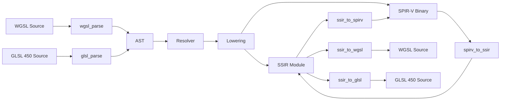
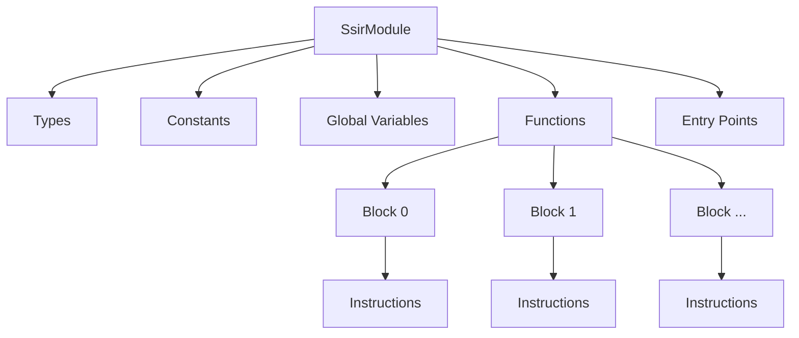
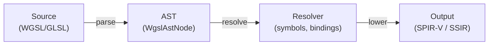

## Simple WGSL

A feature-complete WGSL (WebGPU Shading Language) compiler library written in pure C99.

- Single public header (`simple_wgsl.h`) — no external dependencies
- Bidirectional conversion between WGSL, GLSL 450, and SPIR-V
- Custom intermediate representation (SSIR) as the universal bridge
- Customizable memory allocation for embedding in constrained environments

### Architecture



The compiler uses a shared AST for both WGSL and GLSL input, so the resolver and
lowering stages are reused across both languages. SSIR sits at the center — all
output formats are emitted from it.

### SSIR (Simple Shader Intermediate Representation)

SSIR is a low-level, language-independent IR that serves as the canonical
representation of shader semantics. All conversions flow through it.



Key design choices:

- **ID-based references** — all types, values, constants, and variables use unique
  32-bit IDs instead of pointers, enabling serialization and cross-references
- **SSA form** — every instruction result gets a unique ID; PHI nodes handle
  control-flow merges
- **Explicit control flow** — basic blocks with explicit branch/return terminators
  rather than implicit tree structure
- **Complete type system** — scalars, vectors, matrices, arrays, structs, pointers
  with address spaces, textures, and samplers

SSIR supports 70+ opcodes (arithmetic, bitwise, comparison, vector/matrix ops,
memory, control flow, texture sampling, atomics, barriers) and 72+ built-in
functions (math, vector geometry, derivatives, bit manipulation).

### Source Files

| File | Purpose |
|------|---------|
| `simple_wgsl.h` | Public API — all types, enums, and function declarations |
| `wgsl_parser.c` | WGSL lexer + recursive-descent parser |
| `glsl_parser.c` | GLSL 450 lexer + recursive-descent parser |
| `wgsl_resolve.c` | Semantic analysis: symbol table, bindings, entry points |
| `wgsl_lower.c` | AST → SSIR → SPIR-V compilation |
| `ssir.c` | SSIR module, type system, and builder API |
| `ssir_to_spirv.c` | SSIR → SPIR-V serialization |
| `ssir_to_wgsl.c` | SSIR → WGSL text emission |
| `ssir_to_glsl.c` | SSIR → GLSL 450 text emission |
| `spirv_to_ssir.c` | SPIR-V → SSIR deserialization |
| `wgsl_raise.c` | SPIR-V → WGSL decompilation (via SSIR) |

### Compilation Pipeline

The forward path (source → binary) goes through three stages:



1. **Parsing** — hand-written recursive-descent parsers produce a shared AST
2. **Resolution** — builds a symbol table, extracts `@group`/`@binding` info,
   identifies entry points and shader stages
3. **Lowering** — walks the AST to build SSIR, then serializes to SPIR-V with
   section-buffered emission (words accumulated per section, concatenated in
   SPIR-V spec order)

The reverse path (binary → source) deserializes SPIR-V into an SSIR module,
then emits WGSL or GLSL from it.

### API

**Parsing** (`wgsl_parser.h`)
```c
const char *source = "@vertex fn main() -> @builtin(position) vec4f { return vec4f(0); }";
WgslAstNode *ast = wgsl_parse(source);
printf("Parsed %d declarations\n", ast->program.decl_count);
wgsl_debug_print(ast, 0);  // pretty-print the AST
wgsl_free_ast(ast);
```

**Resolution** (`wgsl_resolve.h`)
```c
WgslResolver *r = wgsl_resolver_build(ast);
int count;
const WgslSymbolInfo *syms = wgsl_resolver_globals(r, &count);
for (int i = 0; i < count; i++) {
    printf("Global: %s (group=%d, binding=%d)\n",
           syms[i].name, syms[i].group_index, syms[i].binding_index);
}
wgsl_resolver_free(r);
```

**Lower to SPIR-V** (`wgsl_lower.h`)
```c
WgslLowerOptions opts = {0};
opts.env = WGSL_LOWER_ENV_VULKAN_1_2;
opts.enable_debug_names = 1;

uint32_t *spirv;
size_t word_count;
WgslLowerResult res = wgsl_lower_emit_spirv(ast, resolver, &opts, &spirv, &word_count);
if (res == WGSL_LOWER_OK) {
    printf("Generated %zu SPIR-V words\n", word_count);
}
wgsl_lower_free(spirv);
```

**Raise from SPIR-V** (`wgsl_raise.h`)
```c
WgslRaiseOptions opts = {0};
opts.preserve_names = 1;

char *wgsl_out;
char *error;
WgslRaiseResult res = wgsl_raise_to_wgsl(spirv, word_count, &opts, &wgsl_out, &error);
if (res == WGSL_RAISE_SUCCESS) {
    printf("Generated WGSL:\n%s\n", wgsl_out);
}
wgsl_raise_free(wgsl_out);
```

### Building

```bash
cmake -B build -G Ninja
ninja -C build
ctest --test-dir build --output-on-failure
```

Or compile directly (parser only):
```bash
cc -c wgsl_parser.c -o wgsl_parser.o
```
